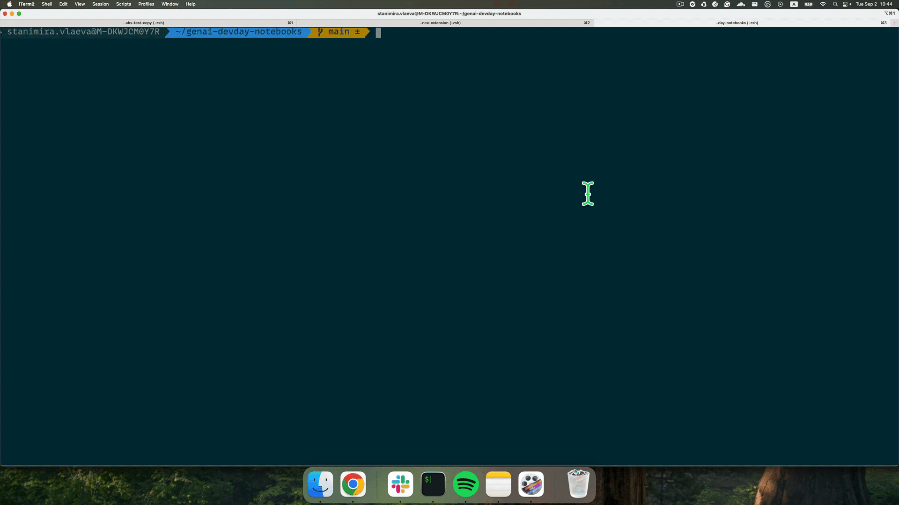

# Open Once – VS Code / Code-Server Extension


Automatically open predefined files (like notebooks, configs, or environment files) when your workspace starts.  
The list of files is controlled directly from your `settings.json` file.

## Features

- Open any file(s) automatically on startup.
- Supports both **VS Code** and **code-server** environments.
- Works with Jupyter notebooks (if the Jupyter extension is installed).
- Listens for changes to your `settings.json` and reopens the updated files automatically.
- Closes all other editors to keep the workspace focused.
- Hides sidebars for a clean, distraction-free setup.
- Simple configuration – no extra commands required.

## Configuration

Add an `openOnce.files` entry to your user or workspace `settings.json`:

```json
{
  "openOnce.files": [
    "./genai-devday-notebooks/.env",
    "./genai-devday-notebooks/notebooks/vector-search-lab.ipynb"
  ]
}
```

The extension will automatically open these files when your editor starts (and whenever the list changes).

## Notes

* Opening Jupyter notebooks require the [Jupyter extension](https://marketplace.visualstudio.com/items?itemName=ms-toolsai.jupyter).
* If a file can’t be opened as a notebook (e.g. the Jupyter extension isn’t loaded yet), the extension will fall back to opening it as plain text.
* Designed for workshops, labs, and reproducible setups where attendees should start with the same files open.

## Disclaimer

Use at your own risk; not a supported MongoDB product
